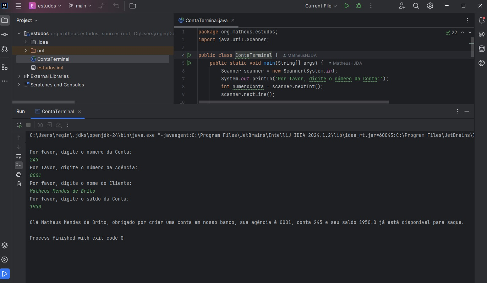
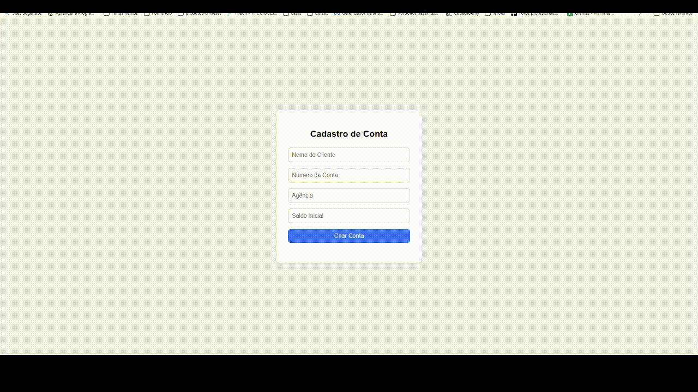

# Bootcamp Bradesco - Java Cloud Native [DIO](https://dio.me)

## Projeto 1 - Entrada de dados no terminal
#### Versão proposta no bootcamp

## Versão atualizada do Projeto 1
#### Esta é uma versão funcional e full stack do projeto 1, usando html, css e java script no frontend e Java com spring boot no backend, diferente da versão proposta, esse modelo trás uma ideia real do funcionamento e implementação do projeto prático.

